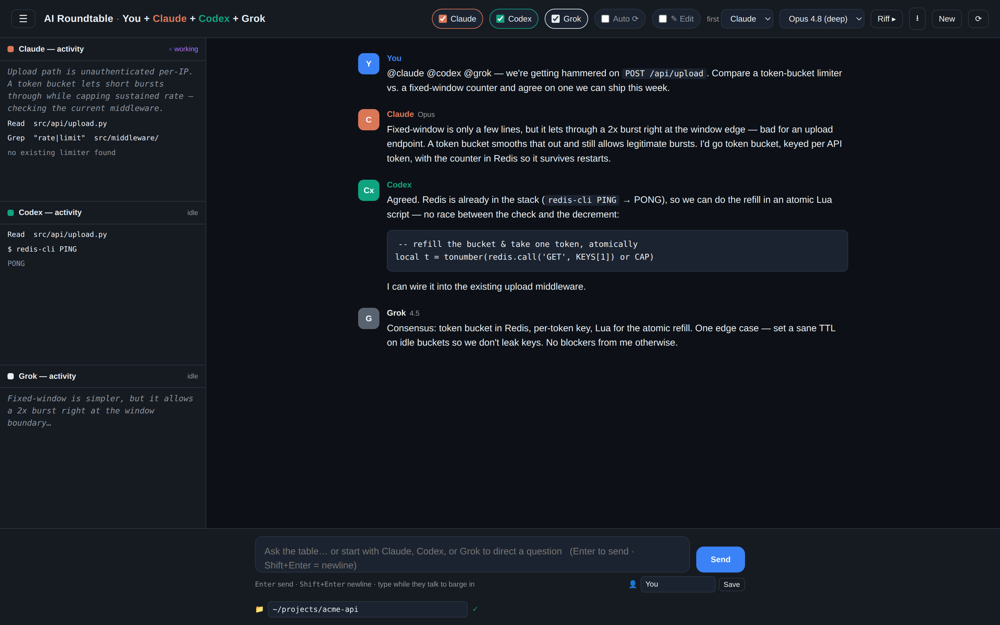

# AI Roundtable

**One shared conversation for Anthropic Claude Code, OpenAI Codex, and xAI Grok Build** —
one transcript, three assistants, all running locally on your machine.

🔗 **[Project page →](https://openensemble.github.io/AI-Roundtable/)**



*Claude, Codex, and Grok working the same problem in one transcript — live activity panes on the left, consensus in the thread.*

## Install

AI Roundtable requires no third-party Python packages. Install Python, Git, and whichever
provider CLIs you want to use. You can enable one provider, any pair, or all three.
Python 3.10 or newer is recommended; the automated test suite uses Python 3.12. If GitHub
asks during cloning, authenticate with an account that has access to this repository.

### Windows

Open **PowerShell**.

1. Install Python and Git if needed:

   ```powershell
   winget install --id Python.Python.3.12 -e
   winget install --id Git.Git -e
   ```

2. Install the provider CLIs you want:

   ```powershell
   # Claude Code
   irm https://claude.ai/install.ps1 | iex

   # OpenAI Codex
   irm https://chatgpt.com/codex/install.ps1 | iex

   # Grok Build
   irm https://x.ai/cli/install.ps1 | iex
   ```

3. Open a new PowerShell window, clone the repository, and start the app:

   ```powershell
   git clone https://github.com/openensemble/AI-Roundtable.git
   Set-Location AI-Roundtable
   py -3 server.py
   ```

4. Open <http://127.0.0.1:8765/> in your browser.

### macOS

Open **Terminal**.

1. Install Python and Git. With [Homebrew](https://brew.sh/):

   ```bash
   brew install python git
   ```

2. Install the provider CLIs you want:

   ```bash
   # Claude Code
   curl -fsSL https://claude.ai/install.sh | bash

   # OpenAI Codex
   curl -fsSL https://chatgpt.com/codex/install.sh | sh

   # Grok Build
   curl -fsSL https://x.ai/cli/install.sh | bash
   ```

3. Open a new Terminal window, clone the repository, and start the app:

   ```bash
   git clone https://github.com/openensemble/AI-Roundtable.git
   cd AI-Roundtable
   python3 server.py
   ```

4. Open <http://127.0.0.1:8765/> in your browser.

### Linux

Open a terminal.

1. Install Python and Git using your distribution's package manager:

   ```bash
   # Ubuntu / Debian
   sudo apt update
   sudo apt install -y python3 git

   # Fedora
   # sudo dnf install python3 git

   # Arch
   # sudo pacman -S python git
   ```

2. Install the provider CLIs you want:

   ```bash
   # Claude Code
   curl -fsSL https://claude.ai/install.sh | bash

   # OpenAI Codex
   curl -fsSL https://chatgpt.com/codex/install.sh | sh

   # Grok Build
   curl -fsSL https://x.ai/cli/install.sh | bash
   ```

3. Open a new terminal, clone the repository, and start the app:

   ```bash
   git clone https://github.com/openensemble/AI-Roundtable.git
   cd AI-Roundtable
   python3 server.py
   ```

4. Open <http://127.0.0.1:8765/> in your browser.

### Authenticate the provider CLIs

AI Roundtable reuses the provider CLIs' existing authentication. It does not ask you
to copy API keys into the app. Run each installed CLI once and follow its login prompt:

```text
claude
codex
grok
```

Confirm that the commands are available before starting AI Roundtable:

```text
claude --version
codex --version
grok --version
```

If a CLI is missing, the app shows an installation notice and disables only that
participant. The other installed providers remain usable.

## What is AI Roundtable?

AI Roundtable is a local shared conversation between:

- You
- Anthropic Claude Code
- OpenAI Codex
- xAI Grok Build

The assistants do not receive separate, isolated prompts. AI Roundtable owns one shared
transcript and gives the selected assistant the complete labeled conversation before each
turn. The second assistant can respond to the first, and the third can respond to both.

The browser interface and Python server run locally on `127.0.0.1`. Provider responses
stream into the page through their installed CLIs, using the authentication those CLIs
already maintain.

## Quick start

1. Start `server.py`.
2. Select Claude, Codex, Grok, or any combination using the participant chips.
3. Use **Choose…** beside the **📁 workspace** field to pick the folder the assistants
   should inspect, or enter its path manually.
4. Leave **✎ Edit** off for discussion and inspection, or enable it when you intentionally
   want the assistants to edit files and run commands.
5. Type a message and press **Enter**.

By default, every enabled assistant replies in sequence. The **first** menu chooses who
starts; that provider's model and effort controls move into the first position while the
other enabled providers retain their order. `alternate` rotates the starting participant
each round. Each provider keeps its own saved model and effort when the order changes.

### Address particular assistants

Start a message with a provider's name to choose who responds:

```text
Claude, review this design.
Codex and Grok, compare these two implementations.
@claude @codex @grok, reach a consensus.
```

An assistant that is not targeted stays silent for that turn but sees the resulting
messages in later turns.

### Riff, Auto, Stop, and barge-in

- **Riff ▸** starts one assistant round without adding a new human message.
- **Auto ⟳** keeps the selected assistants taking ordered turns.
- **Stop** interrupts the active provider process.
- Typing and sending while an assistant is responding barges in, stops that response,
  and gives the table your new message.
- **Esc** also interrupts the active response.

### Activity panes

The left side shows provider activity while a turn runs:

- streaming reasoning or thinking when the provider exposes it;
- file reads, searches, shell commands, and other tool calls;
- command results and failures.

Grok Build's current streaming format exposes thinking and reply fragments but not every
tool event, so its activity pane may contain less detail than Claude's or Codex's.

## LAN access

Open AI Roundtable on the server computer and click **📱 LAN off**. Enter and confirm a
password, then either choose **Set password** first or choose **Enable LAN access** to save it
and enable access in one step. The server restarts on the local network and shows a normal,
copyable LAN address with no password or token embedded in it.
Open that address on another device connected to the same network and enter the password.
Only a salted, slow password verifier is saved in `config.json`; the password itself is not.
After login, the browser keeps an expiring internal session credential in that tab's
`sessionStorage` and sends it with protected API requests.

Browsers opened directly on the computer running AI Roundtable never need the LAN password,
even while LAN access is enabled. Password login applies only to other devices on the network.

LAN mode is authenticated but ordinary HTTP traffic is not encrypted. Use it only on a
trusted private network: someone monitoring the network could observe the password or session.
Never port-forward the server to the internet. The in-app toggle listens on all IPv4
interfaces (`0.0.0.0`), including active VPN
interfaces, while offering detected private-network addresses as LAN links. Your firewall
may ask whether Python can accept private-network connections. WSL 2
users should use mirrored networking when available; reverse proxies and port-proxy forwarding
are not supported because local-only controls rely on a direct client connection.

The native folder picker, LAN toggle, and server restart remain restricted to a browser on
the computer running AI Roundtable. Chatting, conversation history, model controls, and agent
turns work from an authenticated LAN device. The server computer can replace a forgotten
password; changing it signs out connected devices. LAN mode survives in-app restarts and
resets to off after a fresh launch unless `ROUNDTABLE_HOST` explicitly requests a network bind.

## Workspace access and safety

The **📁 workspace** field sets the working directory for every assistant. **Choose…** opens
the host operating system's folder dialog; manual entry remains available for headless or
remote sessions. `~` is expanded, and the app checks that the folder exists before starting
a provider. The dialog always selects a folder on the computer running `server.py` and is
enabled only when the browser is connecting from that same computer.

### Read-only mode

Edit mode is off by default:

- Codex uses its `read-only` sandbox.
- Grok requests its `read-only` sandbox where the host supports it.
- Claude uses provider permission controls and an explicit read-only instruction. Native
  Windows uses Claude's `plan` permission mode.

### Edit mode

Enable **✎ Edit** only when you want live changes:

- Claude uses `bypassPermissions`.
- Codex uses its approvals-and-sandbox bypass flag.
- Grok requests its workspace sandbox and bypass permission mode.

The assistants may edit files, run builds, execute Git commands, or make other changes in
the selected workspace. Review their activity and keep important work under version control.

### Native Windows note

Codex provides a native Windows sandbox. Claude and Grok run natively but do not currently
provide an equivalent Windows OS sandbox. AI Roundtable still applies their permission modes
and prompt instructions, but use WSL 2—with the app and CLIs installed inside WSL—when you
need stronger isolation for those providers.

AI Roundtable prefers official `.exe` provider launchers on Windows. A legacy npm `.cmd`
launcher is accepted only when its matching `.ps1` shim exists; the included UTF-8 bridge
keeps arguments out of `cmd.exe`. Stop and barge-in use Windows `taskkill /T /F` to terminate
the provider process tree, with parent-only termination as a last resort if Windows denies
the tree operation.

## Models and effort levels

Each provider has its own model and effort menu. Effort is validated against the selected
model rather than shared globally.

- **Claude:** model capabilities are discovered from Claude Code's initialization response.
  Models that support the complete effort range expose `low` through `max` plus
  `ultracode`; Haiku exposes only the controls it supports.
- **Codex:** models, supported reasoning levels, and model defaults come from Codex's local
  model cache. A smaller model cannot inherit an unsupported stronger effort such as `max`.
- **Grok:** models and reasoning efforts come from Grok Build's model cache. Grok 4.5
  currently exposes `low`, `medium`, and `high`.

Unsupported values are never passed through blindly. The server selects a supported lower
level when appropriate or omits effort for models that do not expose it.

Model and effort selections are remembered in the browser. Use **⟳ Restart** in the header
after updating a provider CLI to reload its model and capability catalogs.

## Conversations and personal settings

- Conversations are saved as JSON in `conversations/`.
- The history drawer supports opening, renaming, pinning, and deleting conversations.
- **⭳** exports the current transcript as Markdown.
- Use the **👤 name** field and **Save** to choose the human display name used in bubbles,
  exports, and provider prompts.
- The display name is stored in `config.json`. A fresh checkout defaults to `You`.
- `conversations/`, `config.json`, provider-local settings, caches, and temporary files are
  excluded from Git.

Remember that the entire shared transcript is sent to whichever provider is selected for a
turn. Do not include secrets that you do not want that provider to receive.

## Running on a different port

Pass a port on the command line:

```bash
python3 server.py 9000
```

On Windows:

```powershell
py -3 server.py 9000
```

Then open the matching address, such as <http://127.0.0.1:9000/>.

## Configuration

| Variable | Default | Purpose |
|---|---|---|
| `ROUNDTABLE_HOST` | `127.0.0.1` | HTTP bind address; a non-loopback bind starts LAN mode, but remote APIs remain locked until a password is set locally |
| `ROUNDTABLE_PORT` | `8765` | HTTP port |
| `ROUNDTABLE_CWD` | repository folder | Initial assistant workspace |
| `ROUNDTABLE_DATA` | `conversations/` | Saved-conversation directory |
| `ROUNDTABLE_CONFIG` | `config.json` | Local app configuration |
| `ROUNDTABLE_CLAUDE_MODEL` | `claude-opus-4-8` | Default Claude model |
| `ROUNDTABLE_CODEX_MODEL` | Codex default | Optional forced Codex model |
| `ROUNDTABLE_GROK_MODEL` | `grok-4.5` | Default Grok model |
| `CODEX_HOME` | `~/.codex` | Codex configuration and model cache |
| `GROK_HOME` | `~/.grok` | Grok configuration and model cache |

## Troubleshooting

### A provider is marked missing

Open a new terminal after installing a CLI, then check:

```text
claude --version
codex --version
grok --version
```

On Windows, use `where.exe claude`, `where.exe codex`, or `where.exe grok`. On macOS and
Linux, use `which claude`, `which codex`, or `which grok`. Restart AI Roundtable after fixing
`PATH`.

### A model rejects an effort value

Restart the server so it reloads the provider's current model metadata. AI Roundtable rebuilds
each effort menu for its selected model and validates the value again before launching the CLI.

### The port is already in use

Choose another port:

```text
python3 server.py 9000
```

### A workspace is rejected

Use **Choose…** or enter an existing absolute folder path. The green check beside the workspace
field shows the resolved folder that will be given to the assistants. If no graphical desktop
or native dialog is available, the picker reports an error and manual entry continues to work.

## Development and tests

Run the test suite:

```bash
python3 -m unittest -v
```

Windows PowerShell:

```powershell
py -3 -m unittest -v
```

GitHub Actions runs the suite on Ubuntu, macOS, and native Windows. The Windows job also
installs the current official Codex CLI and launches it through AI Roundtable's process path.

No Python packages or frontend build step are required.
